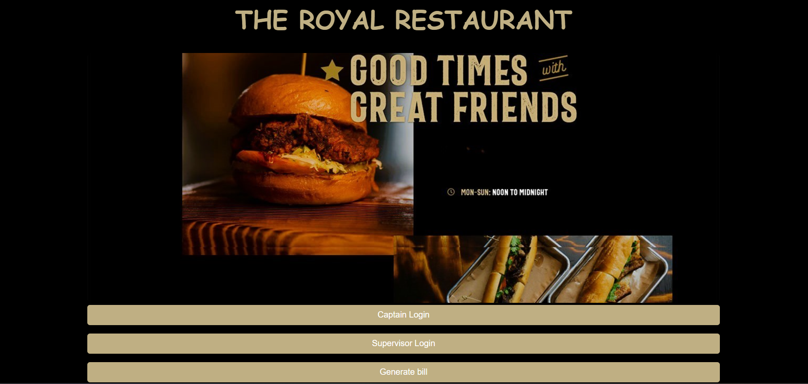
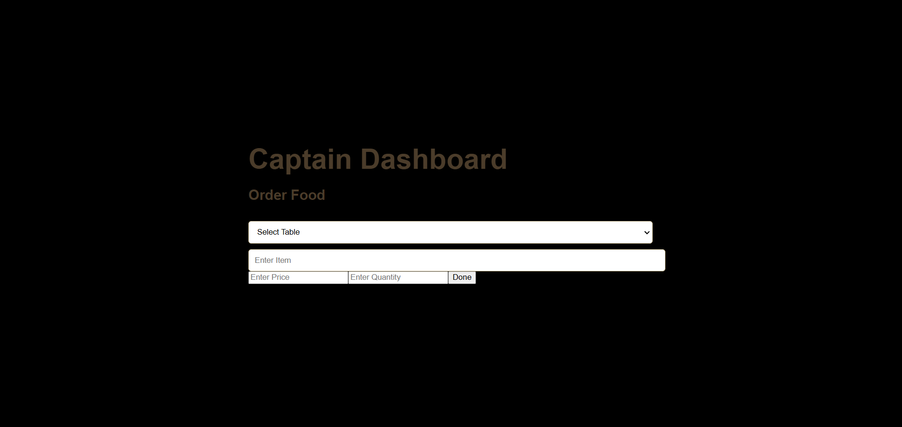
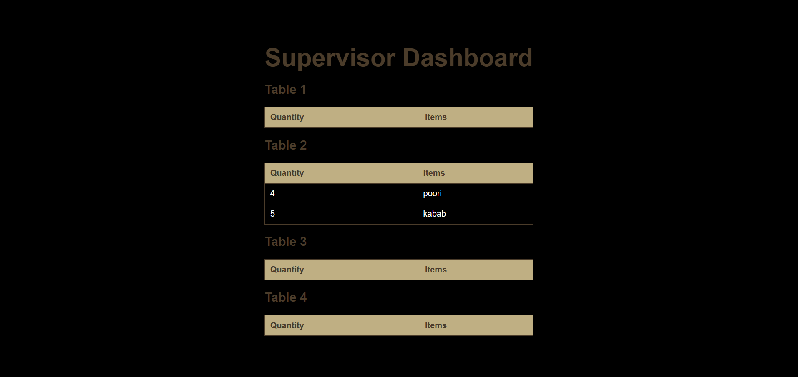
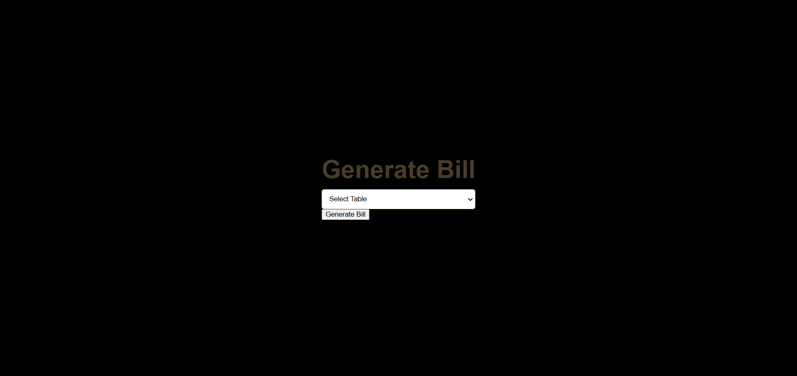
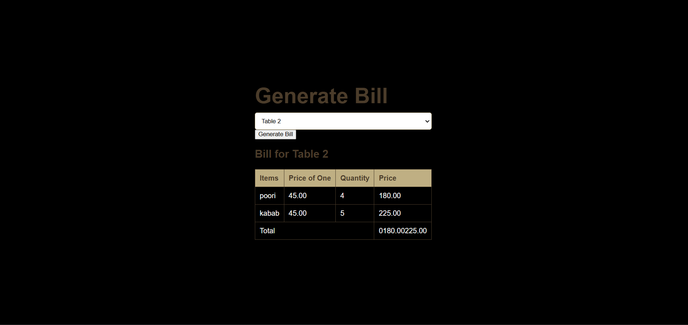

# KOT Automation System

A full-stack application designed to automate the Kitchen Order Ticket (KOT) system in restaurants, streamlining the order placement, kitchen management, and billing processes.

## Table of Contents

  - [Description](https://www.google.com/search?q=%23description)
  - [Features](https://www.google.com/search?q=%23features)
  - [Technologies Used](https://www.google.com/search?q=%23technologies-used)
  - [Setup](https://www.google.com/search?q=%23setup)
  - [Usage](https://www.google.com/search?q=%23usage)
      - [Main Page](https://www.google.com/search?q=%23main-page)
      - [Captain Dashboard (Order Taking)](https://www.google.com/search?q=%23captain-dashboard-order-taking)
      - [Supervisor Dashboard (Kitchen View)](https://www.google.com/search?q=%23supervisor-dashboard-kitchen-view)
      - [Generate Bill (Receptionist)](https://www.google.com/search?q=%23generate-bill-receptionist)
  - [Screenshots](https://www.google.com/search?q=%23screenshots)

## Description

This project automates the traditional KOT system in a restaurant environment. It provides a user-friendly interface for different roles within the restaurant (Captain, Supervisor, Receptionist) to manage orders efficiently. The system aims to reduce manual errors, improve communication between staff, and speed up the overall service process.

## Features

  * **Role-Based Access:** Separate interfaces for Captain, Supervisor, and Receptionist.
  * **Captain Dashboard:**
      * Take new orders.
      * Assign table numbers to orders.
      * Add multiple items to an order with quantities.
  * **Supervisor Dashboard:**
      * View all active orders.
      * Track the status of each item (e.g., pending, preparing, ready).
      * Mark items as prepared or ready for serving.
  * **Generate Bill:**
      * Select a table number to view its pending bill.
      * Generate a final bill for the selected table.
  * **Database Integration:** Stores and retrieves order information persistently.

## Technologies Used

### Frontend

  * **React.js:** For building the user interface.
  * **HTML/CSS:** For structuring and styling the web pages.
  * **JavaScript:** For client-side logic.
  * **React Router:** For navigation between different dashboards.

### Backend

  * **Node.js:** Runtime environment for the server.
  * **Express.js:** Web application framework for building RESTful APIs.
  * **MySQL2:** MySQL client for Node.js to interact with the database.

### Database

  * **MySQL:** Relational database for storing restaurant data (tables, menu items, orders).

## Setup

To set up and run this project locally, follow these steps:

1.  **Clone the repository:**

    ```bash
    git clone https://github.com/shishirsaja/kot_automation.git
    cd kot_automation
    ```

2.  **Backend Setup:**

      * Navigate to the `server` directory:
        ```bash
        cd server
        ```
      * Install backend dependencies:
        ```bash
        npm install
        ```
      * **Database Configuration:**
          * Ensure you have MySQL installed and running.

          * Create a database (e.g., `kot_db`).

          * Update the database connection details in `server/models/db.js` with your MySQL credentials (host, user, password, database).

          * You'll need to create the necessary tables. Here's a basic schema you might use. You may need to adapt this based on your exact `orders.js` implementation.

            ```sql
            -- Example SQL to create tables (adjust as per your schema)
            CREATE TABLE tables (
                id INT PRIMARY KEY AUTO_INCREMENT,
                table_number VARCHAR(10) UNIQUE NOT NULL
            );

            CREATE TABLE menu_items (
                id INT PRIMARY KEY AUTO_INCREMENT,
                item_name VARCHAR(255) NOT NULL,
                price DECIMAL(10, 2) NOT NULL
            );

            CREATE TABLE orders (
                order_id INT PRIMARY KEY AUTO_INCREMENT,
                table_number VARCHAR(10) NOT NULL,
                order_time TIMESTAMP DEFAULT CURRENT_TIMESTAMP,
                status ENUM('pending', 'preparing', 'ready', 'served', 'billed') DEFAULT 'pending'
            );

            CREATE TABLE order_items (
                order_item_id INT PRIMARY KEY AUTO_INCREMENT,
                order_id INT,
                item_id INT,
                quantity INT NOT NULL,
                FOREIGN KEY (order_id) REFERENCES orders(order_id),
                FOREIGN KEY (item_id) REFERENCES menu_items(id)
            );
            ```
      * Start the backend server:
        ```bash
        node server.js
        ```
        The server should start on `http://localhost:5000` (or the port specified in `server.js`).

3.  **Frontend Setup:**

      * Navigate to the `client` directory:
        ```bash
        cd ../client
        ```
      * Install frontend dependencies:
        ```bash
        npm install
        ```
      * Start the React development server:
        ```bash
        npm start
        ```
        This will usually open the application in your browser at `http://localhost:3000`.

## Usage

The application provides different interfaces for various restaurant staff roles.

### Main Page

Upon launching the application, you will be presented with the main page, offering three distinct options: Captain, Supervisor, and Generate Bill.



### Captain Dashboard (Order Taking)

The Captain logs in here to take new orders. They will input the table number and select the food items along with their quantities.



### Supervisor Dashboard (Kitchen View)

The Kitchen Supervisor accesses this page to view all incoming orders. They can monitor the order details and update the status of each item as it progresses through preparation to being ready.




### Generate Bill (Receptionist)

The Receptionist uses this feature to generate bills. They select the table number, and the system retrieves the corresponding order details to prepare the final bill.




## Screenshots

  * **Main Page:**
  * 
  * **Captain Dashboard (Order Entry):**
  * 
  * **Supervisor Dashboard :**
  * 
  * **Generate Bill Page:**
  * 
  * **Generated Bill Example:**
  * 

-----
